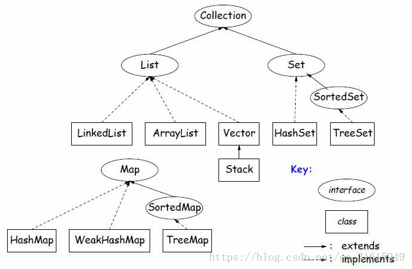

# 集合

## Collection
存储Value
- List  有序集合，可以包含重复元素，可以按索引访问
    - ArrayList   数组，非线程安全
    - LinkedList  双向链表，非线程安全
    - Vector  数组，线程安全，synchronize同步。性能较差。
- Set  无序集合，不能包含重复元素，值唯一，根据equals和hashcode来判断。
    - HashSet  数组+链表，非线程安全，无序
    - TreeSet   红黑树，非线程安全，有序

## [Map](Map.md)

## 对比 ArrayList和linkedList Vector
 都实现了List接口。
 - ArrayList
     - 底层使用数组，内存中开辟一块连续的空间来存储，数据存储是连续的，支持下标来访问元素。
     - 更多元素添加进来时会请求更大的空间，每次对size增长50%。
     - 使用在查询多，插入删除比较少的场景。用的多。
 - Vector 
     - 与ArrayList几乎相同，但是Vector是线程安全的。synchronize 同步。性能较差。
     - 更多元素添加进来时会请求更大的空间，每次请求其大小的双倍空间。
 - LinkedList 
    - 底层使用双向链表。使用在查询少，插入删除比较多的场景。
 
 数组查询查询特定元素比较快，增加修改删除慢（数组在内存中是一块连续的内存，插入删除需要移动内存）。 链表查询慢，增加删除快，（链表内存不需要连续）
 
