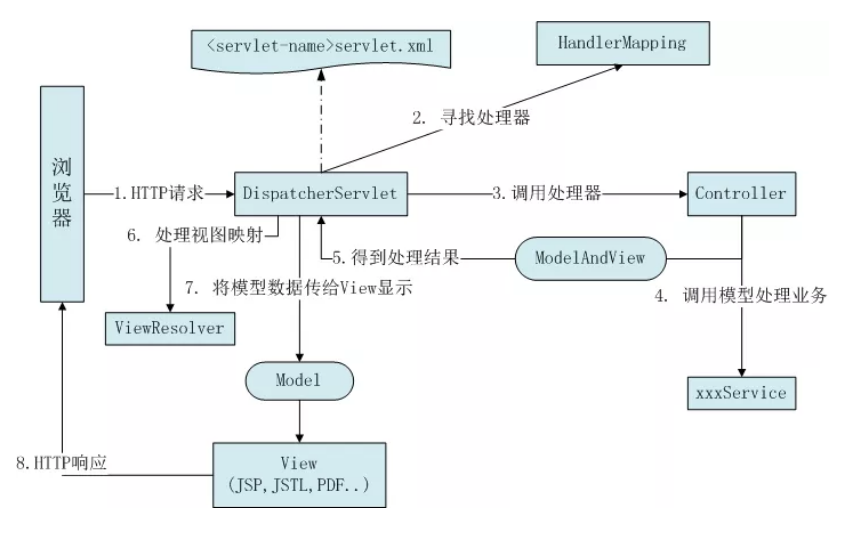

# Spring
> Spring 是一个开源框架，是为了解决企业应用程序开发复杂性而创建的。框架的主要优势之一就是其分层架构，分层架构允许您选择使用哪一个组件，同时为 J2EE 应用程序开发提供集成的框架。

## Spring  

## [Spring 架构底层模型](Spring-Framework.md)

## Spring 架构特征
> 轻量级的 [控制反转IoC](Spring-IoC.md) 和 [面向切面AOP](Spring-AOP.md) 的容器框架。
- **轻量**： 从大小和开销两方面而言，Spring都是轻量的。 1MB
- **控制反转**： Spring通过一种控制反转IOC技术促进了松耦合。当应用了IOC 一个对象依赖的其他对象会通过被动的方式传递进来，而不是这个对象自己创建或者查找依赖对象。
- **面向切面**： Spring提供了面向切面编程的丰富支持，允许通过分离应用的业务逻辑与系统级服务进行内聚性的开发。
- **容器**： Spring 包含并管理应用对象的配置和生命周期。


#### [Spring 详细介绍](Spring-Spring.md)


## SpringMVC 
分离了控制器，模型对象，分派器以及处理程序对象的角色。

#### Spring MVC原理



## [Spring Boot](Spring-Boot.md)
简单易用，轻松上手，其中注解会给使用者提供方便。

对第三方技术进行了很好的封装和整合，提供了大量第三方接口。

可以通过依赖自动配置，不需要XML等配置文件。

提供了安全等特性

简化了基于Spring的应用开发，通过少量的代码就能创建一个独立的 产品基本的Spring应用。
为Spring平台及第三方库提供开箱即用的设置。

设计目的，简化Spring应用的初始化搭建以及开发过程。
默认大于配置。

Spring最初利用“工厂模式” 和代理模式解耦应用组件。大家觉得挺好用，于是按照这种模式搞了一个MVC框架，用来开发web应用（SpringMVC）。然后发现每次开发都要搞很多依赖，写很多样板代码很麻烦，于是搞了一些懒人整合包starter，这就是Spring Boot。

## Spring Cloud
> Spring Cloud是一系列框架的有序集合。

> Spring Cloud并没有重复制造轮子，它只是将目前各家公司开发的比较成熟、经得起实际考验的服务框架组合起来，通过Spring Boot风格进行再封装屏蔽掉了复杂的配置和实现原理，最终给开发者留出了一套简单易懂、易部署和易维护的分布式系统开发工具包。

云端分布式架构解决方案，基于Spring Boot。

Spring MVC => Spring => Spring Boot  => Spring Cloud


## 其他
```text

事务管理。

执行某操作，前50次成功，第51次失败。
a: 全部回滚
b: 前50次提交，第51次抛出异常。
ab场景分别如何设置Spring。（传播性）


spring MVC和Struts2的区别

spring是单例，如果实现多例，怎么实现。

Spring MVC的流程。一个request请求历经了哪些。
最好能画出 springmvc的流程图

Spring注解

spring事务管理机制

spring底层原理

Spring Boot

spring
```