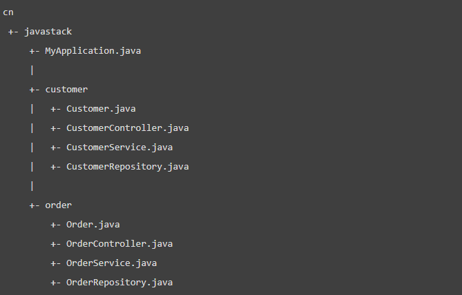
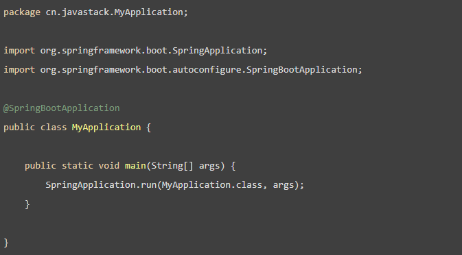
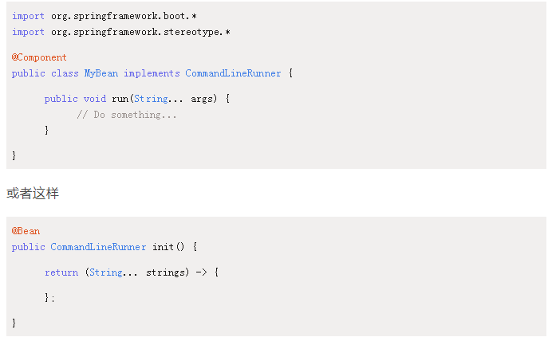
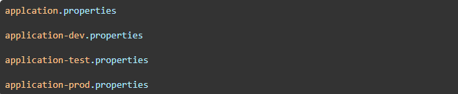

# Spring Boot
> Spring Boot是Spring开源组织下的子项目，也是Spring组件一站式解决方案，主要是为了简化使用Spring框架的难度，简省繁重的配置。

> Spring Boot提供了各种组件的启动器（starters），开发者只要能配置好对应组件参数，Spring Boot就会自动配置，让开发者能快速搭建依赖于Spring组件的Java项目。

> Spring Boot不但能创建传统的war包应用，还能创建独立的不依赖于任何外部容器的独立应用，使用java -jar 命令就能启动。同时，Spring Boot也提供了一个命令行工具来执行Spring的脚本。

> Spring Boot 与传统项目最大的区别就是，传统项目都是打成war包部署到服务器上，需要额外的Servlet 容器，而Spring Boot 则可以直接打成 jar包，并内置集成了 Servlet 容器，通过命令 java -jar xx.jar 就可以直接运行，不需要独立的Servlet 容器。


## Spring Boot优点
- **独立运行** ： 内嵌了各种servlet容器，不需要war包，打可执行的jar包就能独立运行
- **简化配置** ： 启动器自动依赖其他组件，简少了Maven配置。
- **自动配置** ： 自动配置Bean
- **无代码生成和XML配置** ： 借助条件注解
- **应用监控** ： 提供一系列端点可以监控服务和应用
- **上手容易** ： 上手容易 了解核心技术和流程困难，遇到问题棘手。

## 核心配置文件
- **application(.yml .properties)** 
    - 用于Spring Boot项目自动化配置
- **boostrap(.yml .properties)**  
    - 由父ApplicationContext加载，比application优先加载，
    - 属性不能被覆盖
    - 用于使用Spring Cloud Config配置中心时，需要在boostrap配置文件中添加链接到配置中心的配置属性，来加载外部配置中心的配置信息。
    - 用于一些固定的不能被覆盖的属性。
    - 用于一些加密解密的场景。

#### 配置文件格式，书写格式不同。
- .properties
``` text 
app.user.name = javastack
``` 

- .yml
``` text 
app:
    user:
        name:javastack
``` 

## 核心注解

启动类上面的注解是 @SpringBootApplication ，是Spring Boot的核心注解，包含3个注解：
- @SpringBootConfiguration  ，组合了@Configuration 注解，实现配置文件的功能。
- @EnableAutoConfiguration ，打开自动配置的功能，也可以关闭某个自动配置的选项。如关闭数据源自动配置功能 @SpringBootApplication(exclude = {DataSourceAutoConfiguration.class})
- @ComponentScan ， Spring组件扫描

## 开启Spring Boot特性有哪几种方式？ Spring Boot依赖
#### 1.  继承 spring-boot-starter-parent 项目
``` text 
<parent>
  <groupId>org.springframework.boot</groupId>
  <artifactId>spring-boot-starter-parent</artifactId>
  <version>1.5.6.RELEASE</version>
</parent>
```
#### 2.  导入 spring-boot-dependencies项目依赖。
``` text 
<dependencyManagement>
  <dependencies>
    <dependency>
      <groupId>org.springframework.boot</groupId>
      <artifactId>spring-boot-dependencies</artifactId>
      <version>1.5.6.RELEASE</version>
      <type>pom</type>
      <scope>import</scope>
    </dependency>
  </dependencies>
</dependencyManagement>
```

#### Spring Boot依赖注意：
1. 覆盖属性只对继承有效。修改Spring Boot的依赖组件版本可能会导致不兼容的问题。
2. 资源文件过滤问题。

## 关于Spring Boot的几个问题
#### 一、Spring Boot需要独立的容器运行吗？ 
可以不需要，内置了Tomcat等容器

#### 二、运行Spring Boot有哪几种方式？
1. 打包 用命令或者放到容器中运行。
2. 用 Maven/ Gradle 插件运行。
3. 直接main方法运行。

#### 三、Spring Boot 自动配置原理是什么？
自动配置注解 @EnableAutoConfiguration 

@Configuration  @ConditionalOnClass 就是自动配置的核心，首先它得是一个配置文件，其次根据类路径下是否有这个类去自动配置。

#### 四、查看自动配置报告
查看自己加的自动配置类有没有被加载，或者查看所有自动配置激活的和未激活的，可以通过以下几种试查看：
1. spring-boot:run 运行的在对话框 Enviroment 中加入 debug=true变量。
2. java -jar xx.jar --debug 
3. main 方法运行，在 VM Argumanets 加入 -Ddebug 
4. 直接在application文件中加入 debug=true 
5. 如果集成了spring-boot-starter-actuator 监控，通过autoconfig 端点也可以查看。


#### 五、Spring Boot的目录结构是怎么样的？



这个目录结构是主流和推荐的做法，而在主入口类上加上 @SpringBootApplication 注解来开启 Spring Boot 的各项能力，如自动配置、组件扫描等。



#### 六、如何理解Spring Boot 中的 Starters？ 启动器

Starters 启动器，包含了一系列可以集成到应用里面的依赖包，可以一站式集成Spring 及其他技术，不需要到处找示例代码和依赖包。如果你想使用 Spring JPA 访问数据库，只需要加入 spring-boot-starter-data-jpa 启动器依赖就能使用了。

Starters 包含了许多项目中需要用到的依赖，它们能快速持续的运行，都是一系列得到支持的管理传递性依赖。

Spring Boot 官方的启动器都是以 spring-boot-starter- 命名的，代表了一个特定的应用类型。

第三方的启动器，不能以spring-boot 开头命名，它们都被 Spring Boot官方保留。mybatis 的 mybatis-spring-boot-starter 

##### 启动器 Starters 分类：
-  Spring Boot 应用类启动器
``` text 
spring-boot-starter  包含自动配置、日志、YAML的支持。
spring-boot-starter-web  使用Spring MVC构建web功能，包含restful，默认使用Tomcat容器。
……
```
- Spring Boot 生产启动器
``` text 
spring-boot-starter-actuator  提供生产环境特性，能监控管理应用。
```
- Spring Boot 技术类启动器
``` text 
spring-boot-starter-json  提供对JSON的读写支持。
spring-boot-starter-logging  默认的日志启动器，默认使用Logback。
……
```
- 其他第三方启动器。

#### 七、如何在Spring Boot启动的时候运行一些特定的代码代码？
可以实现接口 ApplicationRunner 或者 CommandLineRunner ，这两个接口实现方式一样，都提供了一个run方法。
- CommandLineRunner 启动获取命令行参数
- ApplicationRunner 启动获取应用启时候参数

使用方式：



启动顺序：

如果启动的时候有多个 ApplicationRunner 和 CommandLineRunner ，想控制他们的启动顺序，可以实现 org.springframework.core.Ordered 接口 或者使用org.springframework.core.annotation.Order 注解。

#### 八、Spring Boot有哪几种读取配置的方式？
Spring Boot可以 @PropertySource   @Value  @Environment  @ConfigurationProperties 来绑定变量。

注意： @PropertySource 不支持 yml文件读取。

#### 九、Spring Boot支持哪些日志框架，推荐和默认
Spring Boot 支持 Java Util Logging ， Log4j2， Lockback 作为日志框架。

如果使用Starters 启动器， Spring Boot 将使用 Logback 作为默认日志框架。

无论使用哪种日志框架，Spring Boot都支持配置将日志输出到控制台或者文件中。

spring-boot-starter 启动器包含 spring-boot-starter-logging 启动器，并集成了 slf4j 日志抽象以及 Logback 日志框架。

属性配置日志

自定义日志文件

#### 十、 Spring Boot 实现热部署的方式
主要有两种方式：

Spring Loaded 

spring-boot-devtools


#### 十一、 如何理解Spring Boot 配置加载顺序
在 Spring Boot 里面，可以使用以下几种方式来加载配置。
1. properties 文件
2. YAML 文件
3. 系统环境变量
4. 命令行参数

#### 十二、Spring Boot 如何定义多套不同环境配置？
提供多套配置文件



#### 十三、Spring Boot 如何兼容老Spring项目

使用 @ImportResource 注解 导入老Spring项目配置文件。

#### 十四、 保护Spring Boot应用的方法/ 如何创建更安全的Spring Boot应用程序。
1. 生产中使用HTTPS，传输层安全性（TLS）是HTTPS的官方名称。 TLS是一种加密协议，可以通过计算机网络提供安全通信。主要目标是确保计算机应用程序之间的隐私和数据完整性。
2. 使用Snyk 检查你的依赖关系
3. 升级到最新版本。定期升级应用程序中的依赖项有多种原因。安全性是让你有升级动力的最重要原因之一。
4. 启用CSRF保护
5. 使用内让你给安全策略防止XSS攻击
6. 使用OpenID Connect进行身份验证。
……

#### 十五、 Spring Boot 2.x 有什么新特性，跟1.x 的区别。
- 配置变更
- JDK版本升级。至少需要JDK8， 开始了对JDK9的支持。
- 第三方库升级
- 响应式 Spring 编程支持
- HTT/2 支持
- 配置属性绑定
- Gradle插件，全面重写了
- Kotlin ，提供对Kotlin 1.2 的支持。
- Actuator加强，对执行器端点进行了许多改进，所有HTTP执行端点 现在都暴露在 / actuator路径下，并对JSON结果集也做了改善。
- Data 支持。
- Web加强。
- Quartz 支持
- 测试加强，对测试模块有了一些调整。
- 其他一些改进。
- 动态启动图案支持。